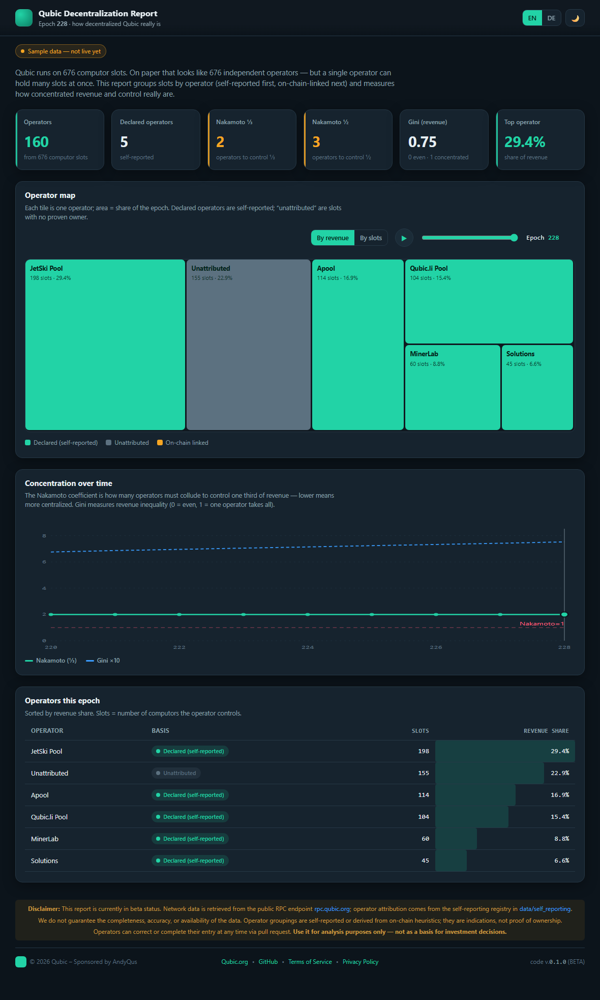

# Qubic Decentralization Report

> ## 📄 Start here: the concept
>
> **[`docs/CONCEPT.md`](docs/CONCEPT.md) (English) · [`docs/CONCEPT.de.md`](docs/CONCEPT.de.md) (Deutsch)**
>
> The concept is the heart of this project — it explains *what* is measured, *why* those
> metrics, and *how* slots are attributed to operators (and where that attribution stops
> being provable). Read it before the code: everything here implements that document.
> Both language versions are kept in sync — any change to one is mirrored in the other.



A tool that measures **how decentralized Qubic actually is** and publishes the result as an
API that explorers can embed, plus a reference dashboard.

It answers the request made by CFB in `#computor-operator`: a report showing **revenue
metrics and their dynamics** and **clustering with the number of computors in each
cluster** — built on Qubic's **self-reporting** anti-Sybil approach and extended with
on-chain and behavioral signals to quantify concentration/collusion among the 676
Computors.

**Run it in one line** (details under [Docker](#docker--publishing)):

```bash
docker run -d -p 8000:8000 -v qdr-data:/data andyqus/qubic_decentralization_report:latest
```

## How the pieces fit together

```
  Data sources                Tool (this repo)                 Consumers
  ────────────                ────────────────                 ─────────
  Qubic RPC 2.0        ┐                       ┌── store ──┐
  Pool self-reporting  ├──▶ ingest → analyze ──▶│  sealed   │──▶ JSON API ──▶ Explorers
  On-chain ledger      ┘        │               │  history  │        │        (embed it)
  (behavioral signals)          │               └───────────┘        │
                                └── reference dashboard (animated + DE/EN + dark/light)

  Closed epochs are computed once and SEALED in the store; the running epoch is
  recomputed live. History survives restarts and RPC outages.
```

**We are the data provider.** The tool computes the report and serves it as an API.
**Explorers are the consumers** — they call the API and display the report on their sites.
The dashboard in this repo is our own reference front-end (and the home of the animated
views).

## Repository layout

```
docs/         Concept, data-source mapping, API spec
api/          The service that serves the computed report (JSON)
analysis/     Revenue-metrics and clustering engines
data/         Cached raw pulls (data/raw), the store (qdr.db) + the self-reporting registry
dashboard/    Reference front-end: charts, animations, DE/EN i18n, dark/light
scripts/      CLI: ingest worker, build reports, validate the registry, verify the dashboard
tests/        Metric + report unit tests
Dockerfile, docker-compose.yaml, .env.example
```

## Dashboard requirements (front-end)

- Layout inspired by existing Qubic community apps (e.g. *Qubic Dividends*).
- Dark / light mode toggle, dark by default.
- German / English language switch, English by default.
- Both choices persisted in `localStorage` (with a safe fallback if storage is blocked).
- Animations only where motion carries meaning (cluster evolution, Nakamoto timeline,
  fund-flow graph) — see `docs/CONCEPT.md` §6.

## Quickstart

```
pip install -r requirements.txt

# 1) run the tests
python3 -m pytest tests/ -q

# 2) sample data (no live RPC needed) -> api/sample/ + dashboard/data.js
python3 scripts/generate_sample.py

# 2b) LIVE data (run where rpc.qubic.org is reachable) -> store + snapshots
python3 scripts/build_report.py --check         # test connectivity
python3 scripts/ingest.py --snapshot            # balance snapshots (fallback revenue)
python3 scripts/build_report.py                 # last 9 epochs into the store

# 2c) keep it current (production): snapshot + refresh + seal epochs as they close
python3 scripts/ingest.py --watch               # <- the one you actually run
python3 scripts/ingest.py --status              # what the store holds
python3 scripts/ingest.py --backfill 30         # fill history

# 3) view it
#   a) just open dashboard/index.html  (bundled sample data)
#   b) or serve API + dashboard together:
uvicorn api.server:app --port 8000
#      then open http://localhost:8000/  (dashboard auto-fetches the live API)
```

### In VS Code (F5)

Press **F5** → *Dashboard (Chrome · sample data)* opens it in Chrome instantly (no setup).
The *Dashboard + live API (Chrome)* config starts the API (`uvicorn`) first and opens the
live dashboard. Tasks for install / tests / sample-data are in the Command Palette →
*Run Task*. (Configs live in `.vscode/`.)

> Note on live data: `rpc.qubic.org` must be reachable from wherever the API/`build_report`
> runs. It is blocked inside the Cowork sandbox, but works from a normal machine — so live
> pulls run fine in your own VS Code / on a server.

### API reference (Swagger)

The API is FastAPI, so the interactive docs come with it — no extra setup:

| URL | What |
|---|---|
| `http://localhost:8000/docs` | **Swagger UI** — every endpoint with *Try it out* |
| `http://localhost:8000/redoc` | ReDoc — the same spec, easier to read |
| `http://localhost:8000/openapi.json` | OpenAPI spec (import into Postman/Insomnia, generate clients) |
| `http://localhost:8000/api` | plain JSON index of the endpoints |

### Embedding in an explorer

A one-line widget, an iframe, or the raw JSON API — see [`docs/EMBEDDING.md`](docs/EMBEDDING.md)
and the live demo at `examples/embed-example.html` (or `http://localhost:8000/examples/embed-example.html`).


## Docker / Publishing

```bash
docker build -t andyqus/qubic_decentralization_report:latest .
docker push andyqus/qubic_decentralization_report:latest
```

The image bundles the API, the dashboard and the embed example, so one container
serves everything on port `8000`. It needs **no secrets** — the report is built purely
from public RPC data. The RPC cache lives in the volume under `/data`.

### Deployment for admins (Docker)

**1. Pull the image**

```bash
docker pull andyqus/qubic_decentralization_report:latest
```

(Alternatively build it yourself: `docker build -t andyqus/qubic_decentralization_report:latest .`)

**2. Put `docker-compose.yaml` + `.env.example` on the server**

Both files are in the repo and must reside in the same directory on the server.

**3. Optional settings** – there are **no mandatory secrets**: the report reads public RPC
data only, and has no login, no database and no uploads. Create the `.env` only if you
want to deviate from the defaults:

```bash
cp .env.example .env
```

```env
QUBIC_RPC_BASE=https://rpc.qubic.org
#QDR_REGISTRY=/data/pools.json
```

**4. Start**

```bash
docker compose up -d
```

Then open `http://<host>:8000/` — the dashboard is served directly and fetches the API
next to it. Health check: `http://<host>:8000/health`.

**5. HTTPS via reverse proxy** – explorers embed the widget from HTTPS pages, so the API
must be reachable over HTTPS too (a browser blocks mixed content otherwise). Minimal
Caddy setup next to the compose file:

```caddyfile
# /etc/caddy/Caddyfile
report.example.org {
    encode gzip
    reverse_proxy localhost:8000
}
```

```bash
sudo apt install -y caddy          # Debian/Ubuntu
sudo systemctl reload caddy        # certificate is obtained automatically
```

Caddy handles the Let's Encrypt certificate on its own. With nginx use a normal
`proxy_pass http://127.0.0.1:8000;` plus certbot.

**6. Keep it updated**

```bash
docker compose pull && docker compose up -d
docker image prune -f              # remove the superseded image
```

**Important for operation:**

- **Two services, one volume.** `qubic_decentralization_report` serves the API and
  dashboard; `qubic_decentralization_report_ingest` keeps the store current — it
  backfills history on first start, refreshes the running epoch every
  `QDR_INGEST_INTERVAL` seconds, and seals each epoch as it closes. The API only ever
  reads what the worker writes, so without the worker the report never advances.
- **Network access:** both containers must reach `rpc.qubic.org` (or whatever
  `QUBIC_RPC_BASE` points at), and the worker additionally reaches `QDR_BOB_URL` for
  the epoch-end payouts. There is **no sample fallback**: figures shaped like real
  measurements are indistinguishable from them once rendered, and this report is read
  as a statement about the network. An unfilled store answers `503` and the dashboard
  says it is still building — it never shows a number nobody measured.
- **First start** takes a few minutes: the worker seals `QDR_BACKFILL_EPOCHS` (default
  10) epochs before the dashboard has anything to show. Watch it with
  `docker compose logs -f qubic_decentralization_report_ingest`.
- **Persistent data** lives in the named volume `qdr-data` → `/data`: the RPC cache and
  the SQLite store of sealed epochs. Inspect it with `docker volume inspect qdr-data`.
  Sealed epochs are re-derivable from a Bob node, so a backup is nice-to-have rather
  than critical — but re-deriving costs a backfill.
- The app listens on port `8000` inside the container (mapped to host `8000`). A reverse
  proxy (e.g. Caddy/Nginx) for HTTPS belongs in front of it, especially since explorers
  embedding the widget will load it over HTTPS.
- **CORS is open (`*`) by design** — the point is for third-party explorers to embed the
  report. The API is read-only (`GET` only), so there is nothing to protect against
  writes; do put a rate limit in the reverse proxy if you expose it publicly.
- **The registry** (`data/self_reporting/pools.json`) is baked into the image. To run
  your own without rebuilding, mount it and set `QDR_REGISTRY` — see the commented
  lines in `docker-compose.yaml`.
- The container runs as a **non-root user** (uid 10001). The named volume above gets the
  correct ownership automatically. If you switch to a host bind mount instead, run
  `sudo chown -R 10001:10001 <path>` once, otherwise the cache cannot be written.

## Configuration (environment variables)

| Variable | Purpose | Default |
|----------|---------|---------|
| `QUBIC_RPC_BASE` | Qubic RPC endpoint the report is built from | https://rpc.qubic.org |
| `DATA_DIR` | Storage for the RPC cache (`$DATA_DIR/raw`) | (local: `data/raw`) |
| `QDR_REGISTRY` | Path to the self-reporting registry | bundled `data/self_reporting/pools.json` |
| `QUBIC_ARBITRATOR` | Arbitrator identity used for revenue derivation | built-in default (**unverified** — run `ingest.py --verify-arbitrator`) |
| `QDR_DB` | Persistent store holding sealed epochs and history | `$DATA_DIR/qdr.db` (local: `data/qdr.db`) |
| `QDR_LIVE_MAX_AGE` | Seconds the running epoch may be stale before a request recomputes it | `300` |
| `QDR_BOB_URL` | Bob node carrying the epoch-end payouts (use your own node) | `https://bob.qubic.li/qubic` |
| `QDR_PULSE_TTL` | Seconds the live pulse is cached | `10` |

## Status

Working end-to-end on sample data: research + core engine + persistent store + API +
dashboard are in place.

**v0.2** reworked the analysis after community feedback (see
[`docs/CONCEPT.md`](docs/CONCEPT.md) §7.1):

- **On-chain linkage is now the primary attribution layer**, not an optional hook. Slots
  are `unattributed` only when the ledger shows no link — every report states its
  `linkage_coverage` so a reader can tell resolved from assumed.
- **Full transaction tracking** for revenue: epoch-scoped tick windows, exhaustive
  pagination, reconciliation, and a `revenue_provenance` block so a third party can locate
  a divergence rather than argue about totals.
- **Persistent history**: closed epochs are sealed in a SQLite store and served from disk;
  only the running epoch touches the network. Recomputes under a new `code_version` land
  beside the old ones instead of overwriting them.

- **Forward-compatible by design**: no network constant is hardcoded (the UI language files
  use `{slots}` / `{epoch}` placeholders filled from live data, so translations never go
  stale), new pools need no code change, unknown confidence levels degrade honestly, and API
  responses stay a constant size as history grows. Covered by `tests/test_forward_compat.py`.

### Live-chain findings (2026-09-07)

Running the pipeline against the live network produced substantive results, recorded in
[`docs/DATA_SOURCES.md`](docs/DATA_SOURCES.md) §6–§8.

**Per-computor revenue is not exposed by the public RPC.** The arbitrator identity carried
since v0.1 paid **0 of 676** computors, and scanning ~4,500 transactions per computor across a
full epoch found no inbound payments — what computor identities emit is `amount = 0` solution
submissions. Revenue is credited by protocol-level emission, so "track the arbitrator's
payouts" cannot work against the public RPC however completely it paginates.

**A Bob node has it.** Bob keeps the full event log, including the virtual end-epoch tick
where the protocol credits every computor. One call per epoch
(`qubic_getEndEpochLogs`) returns the settlement, and history reaches back to at least epoch
220 — so the report starts with real history instead of from zero:

| Epoch | Computors paid | Revenue |
|---|---|---|
| 225 | 676 / 676 | 357,094,835,754 QU |
| 226 | 676 / 676 | 360,401,553,845 QU |
| 227 | 676 / 676 | 180,603,819,833 QU |
| 228 | 676 / 676 | 178,477,462,349 QU |

Set `QDR_BOB_URL` to your own node (RPC port 40420) rather than depending on the public one.
Balance deltas from our own snapshots remain the fallback when no Bob node is reachable.

**No on-chain linkage between computors is currently provable.** All 676 payouts come from
the same null address (protocol emission, not a wallet), and computors' own outgoing
transfers are uniformly 1,000,000 QU burns to that address. Both are traps for a naive payout
graph — one of them cost a bug that claimed 100% on-chain coverage while proving nothing. The
report states `linkage_coverage: 0` rather than implying independence, and the dashboard
warns that the Nakamoto figure is an **upper bound** on decentralization. Pool self-reports
are what would sharpen it.

**Update cadence, measured:** the tick advances ~2.7/s while the analysis changes once per
epoch (~4.4 days, though epoch length varies 1.08M–2.29M ticks). Hence two clocks —
`/v1/pulse` for the live view (poll every 15 s) and the report only when the epoch turns.

Remaining for production: filling the self-reporting registry with real pool declarations
(the single biggest lever now), a `qubic.li` Score API token as an independent cross-check,
and comparing methods with the implementation that reports converging numbers. See the
roadmap in [`docs/CONCEPT.md`](docs/CONCEPT.md) §9.

## Bounty

A community bounty (~2B QU) has been offered for a decentralization report that gets
accepted and embedded by explorers. This project targets that deliverable.

## License

MIT — see [`LICENSE`](LICENSE). Use it, fork it, embed it, ship it commercially; just keep
the copyright notice. Pool self-reports and other contributions are accepted under the same
terms via pull request.
